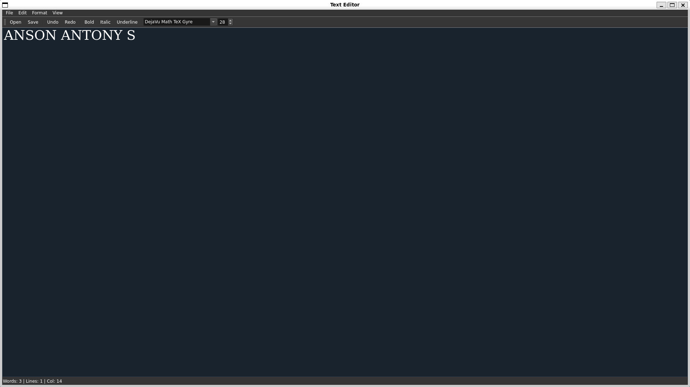

# Qt Text Editor  

A simple yet powerful **Qt-based text editor** with essential text editing features, including **syntax highlighting, font customization, dark mode, and formatting options**.  

🚧 **This project is ongoing.** Currently, the following features have been implemented:  

## ✅ **Implemented Features**  
- **File Operations:** Open, Save  
- **Text Formatting:** Bold, Italic, Underline  
- **Font Customization:** Font family, Font size  
- **Dark Mode** 🌙  
- **Undo & Redo**  
- **Syntax Highlighting** for keywords (C++ support)  

### **📸 Screenshot**  


## 🚀 **Upcoming Features**  
- **Find & Replace** 🔍  
- **Tab Support** for multiple files  
- **Line Numbers** 📌  
- **Auto-indentation**  
- **Custom Themes** 🎨 (Light/Dark mode improvements)  
- **Markdown Preview** 📖  
- **Code Folding** 🔽  
- **Multi-language Syntax Highlighting** (Python, Java, etc.)  

## 🔧 **Build Instructions**  
### **1️⃣ Install Dependencies**  
#### Ubuntu/Debian  
```sh
sudo apt update
sudo apt install qtbase5-dev qttools5-dev qttools5-dev-tools cmake g++
```


### **2️⃣ Build the Project**  
```sh
mkdir build && cd build
cmake ..
make -j$(nproc)
./TextEditor
```

💡 **This project is under development** – stay tuned for updates! 🚀  
