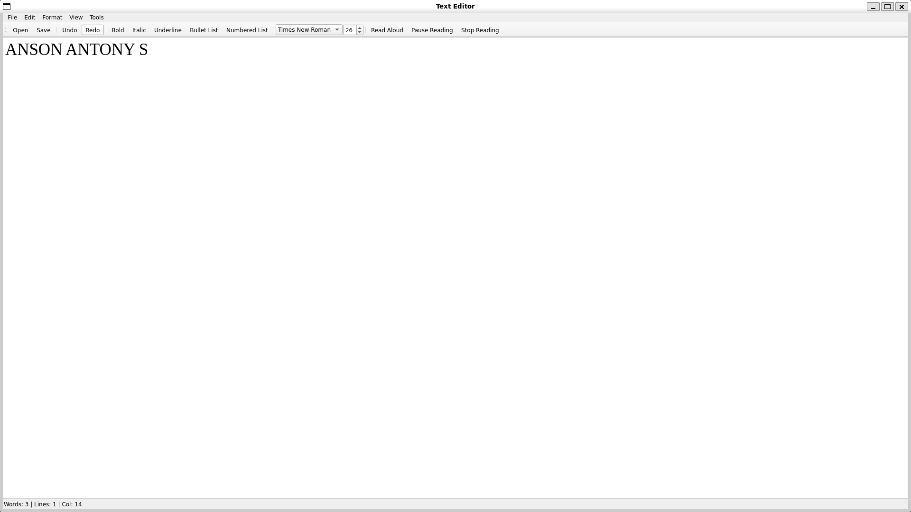
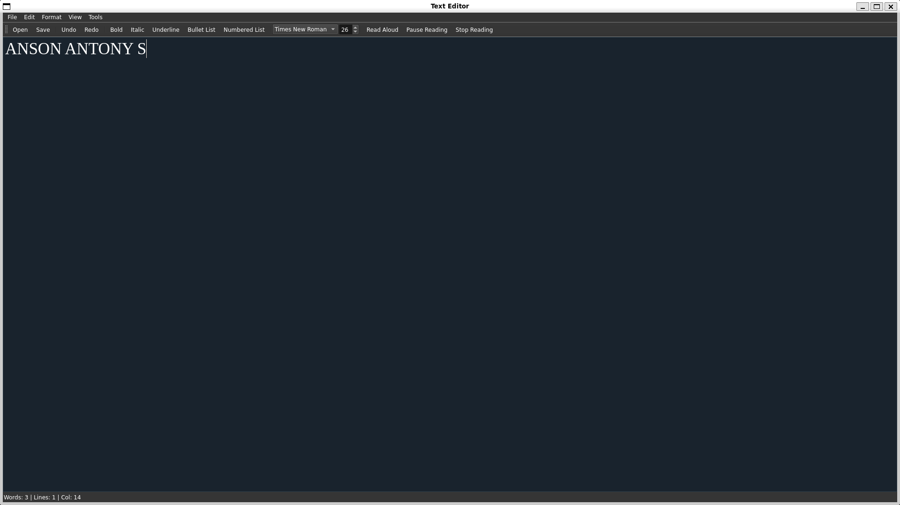

# 🌟 Nova – Your Lightweight Text Editor

Welcome to **Nova**, a sleek and powerful text editor designed to make your writing and coding experience effortless and enjoyable. Built with **Qt 5**, Nova combines simplicity with functionality, offering everything you need to edit, format, and explore your text. Whether you're drafting notes, writing code, or just playing around with words, Nova is here to light up your workflow. 

---

## 📸 Screenshots


*Light Mode – for those who love the sunshine.*


*Dark Mode – for the night owls.*
---

## 🚀 Features

### What Makes Nova Shine? 🌠

- **Text Editing**: The basics, but better! Copy, paste, undo, and redo like a pro.
- **File Operations**: Open and save files with ease. Your work is safe with us!
- **Text Formatting**:
  - **Bold**, *italic*, and _underline_ your text to make it pop!
  - Create **bullet lists** and **numbered lists** for organized thoughts.
- **Syntax Highlighting**: Because colorful code is happier code.
- **Dark Mode**: Toggle between light and dark themes. Your eyes will thank you!
- **Text-to-Speech**: Let your computer read your text aloud. Perfect for proofreading or just chilling.
- **Statistics**: Get insights into your document – word count, character count, and more!
- **Font Customization**: Change fonts and sizes to suit your style.
- **Find and Replace**: Find what you need in a snap and replace it effortlessly.

---

## 🌌 Features to Come

We’re just getting started! Here’s what’s on the horizon for Nova:

- **Markdown Support**: Write in Markdown and preview it in real-time. Perfect for bloggers and developers!
- **Auto-Save**: Never lose your work again. We’ll save it for you, automatically.
- **Multi-Tab Support**: Juggle multiple files like a pro with tabbed editing.
- **Spell Check**: Say goodbye to embarrassing typos.
- **Custom Syntax Highlighting**: Add support for more programming languages. Your code, your rules.
- **Export Options**: Export your work to PDF, HTML, or other formats. Share it with the world!
- **Custom Themes**: Create and apply your own themes. Make it truly yours.
- **Plugins**: Extend functionality with plugins. The possibilities are endless!
- **Collaboration**: Work together in real-time. Teamwork makes the dream work!

---

## 🛠️ Installation

### Prerequisites
- **Qt 5**: Make sure you have Qt 5 installed. It’s the backbone of Nova.
- **C++ Compiler**: Grab a C++ compiler like `g++` or `clang`.
- **speech-dispatcher** (Linux): Needed for text-to-speech functionality on Linux.

### Let’s Get Started!

1. **Clone the Repository**:
   ```bash
   git clone https://github.com/yourusername/nova.git
   cd nova
   ```

2. **Install Dependencies**:
   - On Ubuntu/Debian:
     ```bash
     sudo apt update
     sudo apt install qt5-default speech-dispatcher
     ```

3. **Build the Project**:
   ```bash
   mkdir build
   cd build
   qmake ..
   make
   ```

4. **Run the Application**:
   ```bash
   ./Nova
   ```

---

## 🎮 Usage

### Opening and Saving Files
- **Open**: `File > Open` or `Ctrl+O` – because your files deserve to be seen.
- **Save**: `File > Save` or `Ctrl+S` – save your masterpiece for posterity.

### Formatting Text
- **Bold**: `Format > Bold` or `Ctrl+B` – make it bold, make it stand out!
- **Italic**: `Format > Italic` or `Ctrl+I` – for those *fancy* moments.
- **Underline**: `Format > Underline` or `Ctrl+U` – underline your brilliance.
- **Bullet List**: `Format > Bullet List` or `Ctrl+L` – organize your thoughts.
- **Numbered List**: `Format > Numbered List` or `Ctrl+Shift+L` – count your ideas.

### Text-to-Speech
- **Start Reading**: `Tools > Read Aloud` or `Ctrl+R` – let your computer do the talking.
- **Pause Reading**: `Tools > Pause Reading` or `Ctrl+Shift+R` – take a breather.
- **Stop Reading**: `Tools > Stop Reading` or `Ctrl+Alt+R` – silence is golden.

### Dark Mode
- Toggle dark mode using `View > Dark Mode` or `Ctrl+D` – because the dark side has cookies.

### Statistics
- View document stats using `View > Show Statistics` or `Ctrl+T` – knowledge is power!

---

## 🤝 Contributing

We’d love to have you on board! Here’s how you can contribute:
1. Fork the repository.
2. Create a new branch for your feature or bugfix.
3. Commit your changes.
4. Submit a pull request.

Let’s build something amazing together!

---

## 📜 License

This project is licensed under the **MIT License**. Feel free to use, modify, and share it. See the [LICENSE](LICENSE) file for details.

---

## 💌 Contact

Got questions or feedback? We’d love to hear from you!
- **Email**: ansonantony@xplore.icu
- **GitHub**: [anson10](https://github.com/anson10)

---

Happy editing with **Nova**! 🌟

---
